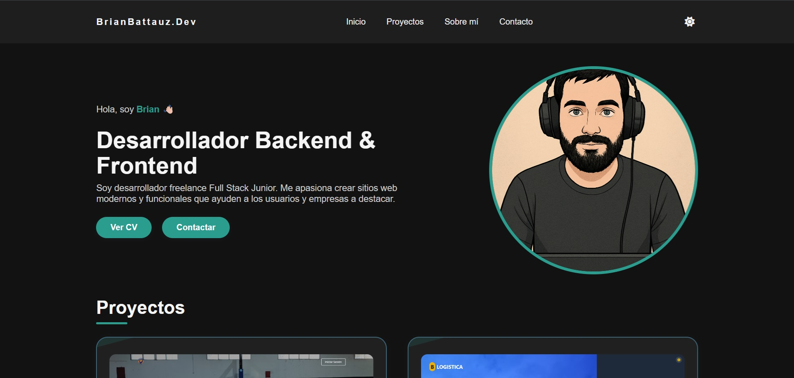

# 🌐 Portfolio - Brian Nicolas Battauz

Este es mi **portfolio web personal**, desarrollado para mostrar mis proyectos, habilidades y experiencia como **desarrollador Full Stack Junior**.  
Incluye un diseño moderno, adaptable y funcional, con modo oscuro, animaciones y una sección de contacto interactiva.



---

## 🚀 Tecnologías Utilizadas

- **Frontend:**  
  - HTML5  
  - CSS3  
  - JavaScript  
  - [Font Awesome](https://fontawesome.com/) (iconos)
  
- **Despliegue:**  
  - GitHub Pages

---

## ✨ Características

- **Diseño responsive** adaptable a móviles, tablets y escritorio.  
- **Modo oscuro** activable con un botón.  
- **Animaciones y efectos** en botones, cards y navegación.  
- **Secciones principales:**
  - Inicio con presentación personal.
  - Proyectos destacados con imágenes y enlaces.
  - Habilidades con iconos de tecnologías.
  - Experiencia laboral.
  - Formulario de contacto funcional (diseño).
- **Menú móvil desplegable** con scroll suave.
- **Links a redes sociales** (GitHub, LinkedIn, WhatsApp, Email).

---

## 📂 Estructura del Proyecto

```bash
📦 portfolio-brian-battauz
 ┣ 📂 assets
 ┃ ┣ 📂 images        # Imágenes del portfolio
 ┃ ┣ 📂 logos         # Iconos de tecnologías
 ┃ ┗ 📂 cv            # CV en PDF
 ┣ 📂 css
 ┃ ┗ styles.css       # Estilos principales
 ┣ 📂 js
 ┃ ┗ script.js        # Lógica del modo oscuro, scroll y menú
 ┣ index.html         # Página principal
 ┗ README.md          # Documentación del proyecto
```

---

## 🖼️ Vista Previa

Puedes visitar el portfolio online aquí:  
🔗 **[Portfolio de Brian Battauz](https://brian13b.github.io/portfolio-brian-battauz/)**

---

## 📬 Contacto

Si deseas trabajar conmigo o tienes alguna propuesta:

- **Email:** [brian.nbattauz@gmail.com](mailto:brian.nbattauz@gmail.com)
- **WhatsApp:** [Enviar mensaje](https://wa.me/3434676232?text=Hola%20quiero%20más%20información)
- **LinkedIn:** [Perfil](https://www.linkedin.com/in/brian-battauz-75691a217/)
- **GitHub:** [@Brian13b](https://github.com/Brian13b)

---

## 📄 Licencia

Este proyecto está bajo la licencia MIT.  
Puedes usarlo, modificarlo y distribuirlo libremente, pero manteniendo la atribución al autor original.

---